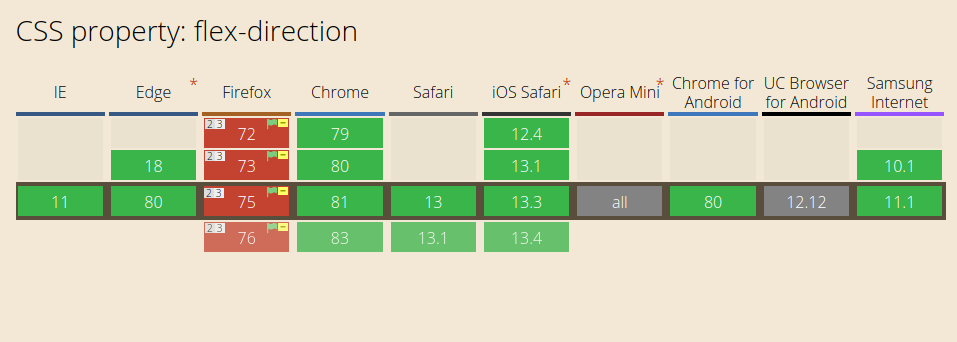

Flexbox is the go-to method for fluid and responsive layouts. With it's excellent configurability and pretty darn [good support](https://caniuse.com/#feat=flexbox), it's being used anywhere you can stash a `<div>`. It's completely direction-agnostic, which is incredibly useful when building components that need to stretch, centre and overflow in complex layouts. This article is based around the behaviour of `flex-direction`, how simple it should be yet how complex it quickly becomes.

# You've got my `flex-`attention

When creating Picto, a real-time chat application, we needed a way to display a message history that put the most recent item to the bottom of a scrollable chat container. When a new message arrives, modern messaging clients are expected to behave a particular way:

- Display messages with the most recent ones arriving at the bottom.
- If I'm scrolled to the bottom and a new one arrives, keep me at the bottom so I can see the latest message.
- If I've scrolled up to view an earlier message, and a new one arrives, keep me where I am.

Like most people facing a similar predicament, we immediately flocked to `flex-direction: column-reverse`. The markup is simple, concise and understandable.

```html
<div class="flex-container">
    <!-- Note that newest elements are prepended, not appended -->
    <div class="flex-item message">I do!</div>
    <div class="flex-item message">Who wants brownies?</div>
</div>
```

```css
.flex-container {
    display: flex;
    flex-direction: column-reverse;
    overflow-y: scroll;
}

.flex-item {
    /* prevent messages getting squished and stretched */
    flex: 0;
}
```

Better still, it worked like a charm, no JavaScript needed. When I'm at the bottom and a new element is prepended, I can see it immediately and stay in the flow. If I'm catching up on something I missed, I don't get shoved around.

# The fall

We pushed our solution to production and sat back to admire our work. It was so simple and elegant, with no need for JS powered scrolling or horrendous markup.

The thing with something so wonderful and great in the world of web development is it must be too good to be true. A good friend of mine took the site for a test-drive, and left one rather confused remark:

> I can't scroll backwards

Firefox has a rather fickle relationship with Flexbox. It doesn't overflow if some obscure arrangement of itself, it's parents and flex-items don't have correctly set `min-height`s (although this is somehow [intended behaviour](https://drafts.csswg.org/css-flexbox/#min-size-auto). Go figure).

After plastering `min-height: 0;` on every possible variation of the container, parents and children; accelerating the recession of my hairline and wasting countless hours that could be spent elsewhere: no dice. The container still wouldn't scroll, and would taunt me with a useless, disabled scrollbar.

# The awakening



If you pop over to check the support for `flex-direction`, you'll see some [rather interesting footnotes](https://caniuse.com/#feat=mdn-css_properties_flex-direction) scattered all over the Firefox column.

> Does not support overflow when using `*-reverse`. See [bug 1042151](https://bugzil.la/1042151) for more info.

Bug [1042151](https://bugzil.la/1042151) has been open for 6 years and doesn't seem like it'll be getting a fix anytime soon. As the questions littered across Stack Overflow demonstrate, this seems to be a fairly common use case and issue to run into. Almost every answer however, demonstrates some wild JavaScript-heavy alternative or a workaround that looses the distinct benefit of the sticky-scrolling.

# The solutions

With our hearts broken and dreams of simple markup ruined, we returned to the drawing board and came up with some rather interesting solutions.

## Flip it, then flip it again

Thinking about it, `flex-direction: column-reverse` is just the same as `flex-direction: column` but flipped upside down right?

```css
.flex-container {
    display: flex;
    flex-direction: column;
    transform: scaleY(-1); /* flip it upside down */
    overflow-y: scroll;
}

.flex-item {
    flex: 0;
    transform: scaleY(-1); /* flip the items the right way up */
}
```

Sounds pretty dumb and looks pretty dumb. Unfortunately it works almost perfectly! On mobile, scrolling isn't inverted and works (mostly) as expected, and on desktop spinning the scroll-wheel the other way didn't seem that bad.

We actually used this solution for a while, until we realised chrome mobile would inexplicably flip scroll directions seemingly randomly. Some users ended up stuck, trying to scroll only to have it go the wrong way whichever direction they tried.

## Overflow anchors

If you've been paying attention to recent updates to the CSS spec, you may have noticed the appearance of overflow anchors, which in theory would allow a container to stick at the bottom, even when new messages are added.


Unfortunately this is a rather new feature, and as such Safari hasn't quite caught up, and even browsers with support come unstuck sometimes. The problem is compounded by the fact the 'stickiness' is not active by default, and needs to be triggered with a scroll to the bottom of the container. However wonderful it would be to fix a CSS issue with CSS, overflow anchors aren't reliable enough to be a good enough solution (yet).

## Browser Detection

Everywhere you go, browser detection is being replaced with feature detection. That's not the case here. Running a `@supports` query on Firefox leads it to happily tell you it supports `column-reverse`:

```css
@supports (flex-direction: column-reverse) {
    /* Firefox claims it supports this. Silly Firefox. */
}
```

Fortunately it's fairly easy to detect Firefox in JavaScript, due to some hooks they add to the window for [installing legacy add-ons](https://developer.mozilla.org/en-US/docs/Web/API/InstallTrigger).

```js
isFirefox() {
	// Firefox browser detection
	return typeof InstallTrigger !== "undefined";
}
```

Using this we can apply a class to the flex container, that makes use of transforms if on Firefox, otherwise it defaults to using good ol' `column-reverse`.

```scss
.flex-container {
    display: flex;
    flex-direction: column-reverse;
    overflow-y: scroll;

    &.firefox {
        flex-direction: column;
        transform: scaleY(-1);

        .flex-item {
            transform: scaleY(-1);
        }
    }
}
```

It's a slightly odd solution, and obviously requires a touch of JS on load, but for our use case, we determined this to be the best solution.

# Summary

None of these solutions are perfect, but performing browser detection comes pretty close. Online messaging is a rather sensible use case for `flex-direction: column-reverse`, and when it works well it's fantastically concise and easy to implement. I hope you found this useful for when you hit a similar roadblock. Whilst I hope the bug does get fixed in the future, for now it seems like workarounds like the ones above will be the norm.

If you've found another neat way to get around this issue, [I'd love to hear it](https://twitter.com/onfe1)!

*Update:* It looks like [Firefox 81 should fix this](https://bugzil.la/1042151)!
